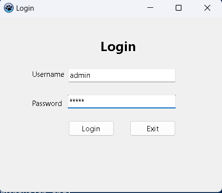
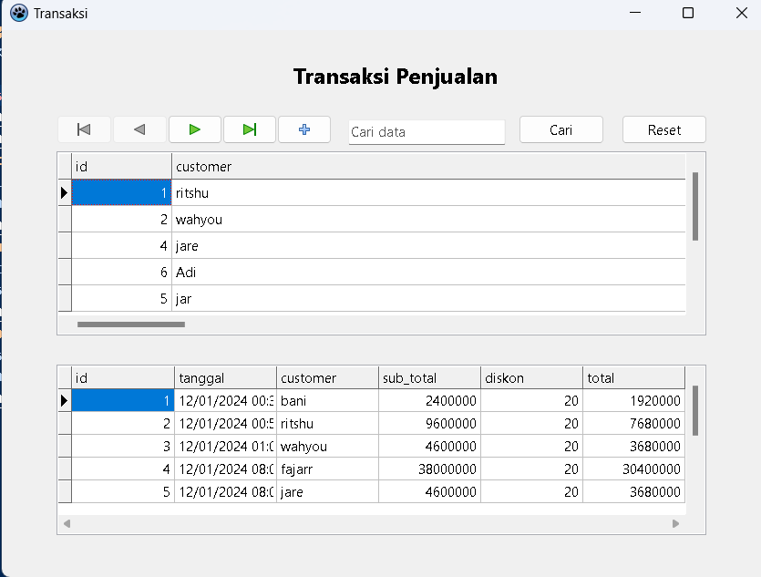
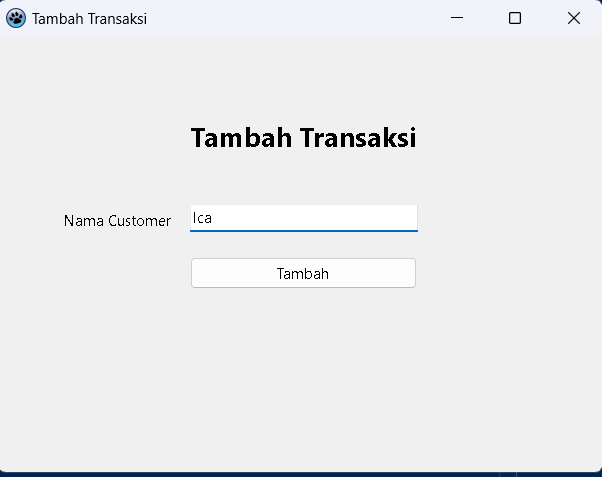
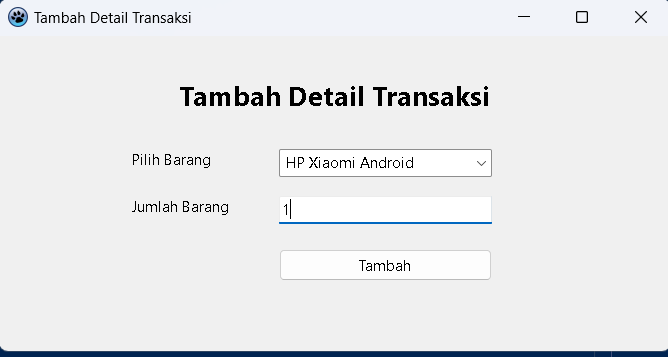
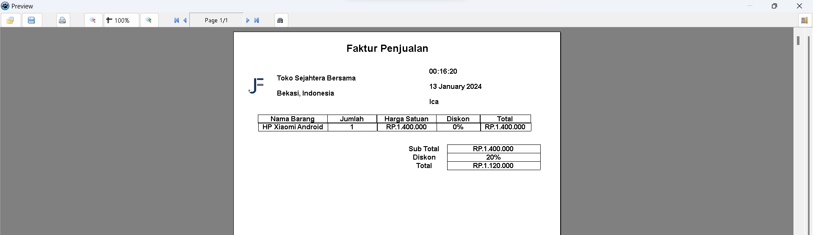
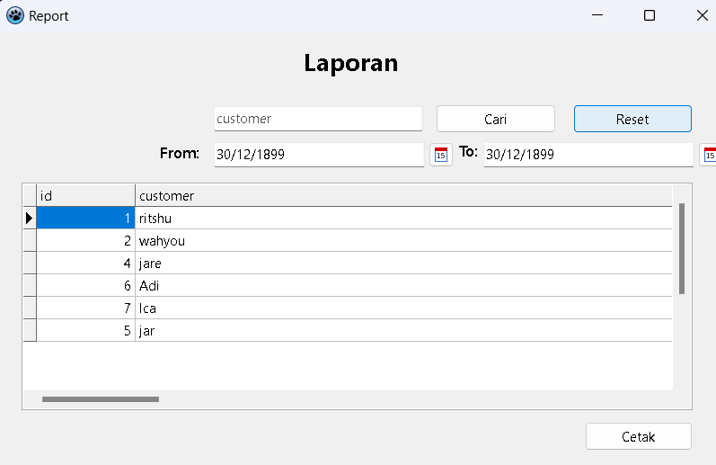
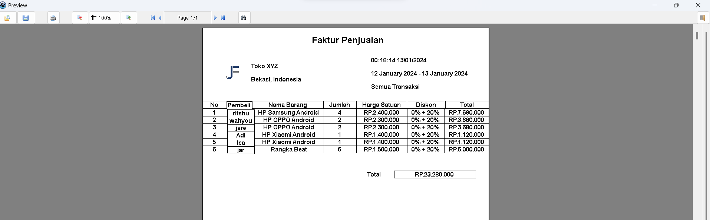

# Project UAS - Aplikasi Manajemen Penjualan
## Informasi
- Nama : Jose Fisto
- Nim : 312010119
- Kelas : TI.20.A.RPL-1

## Deskripsi Proyek

Proyek ini bertujuan untuk mengembangkan sebuah aplikasi manajemen penjualan yang terintegrasi. Aplikasi ini mencakup fungsionalitas dasar untuk mengelola data master, transaksi penjualan, dan laporan transaksi. Proyek ini memiliki menu-menu utama sebagai berikut:

### 1. File
   - **Login:** Memungkinkan pengguna untuk masuk ke dalam aplikasi.
   - **Logout:** Memungkinkan pengguna untuk keluar dari aplikasi.
   - **Exit:** Menutup aplikasi.

### 2. Data Master
   - **Data Barang:** Mengelola informasi mengenai barang yang tersedia.
   - **Data Kategori Barang:** Mengelola kategori barang.
   - **Data Customer:** Mengelola data pelanggan.

### 3. Transaksi
   - **Transaksi Penjualan:** Mencatat penjualan barang, lengkap dengan kemampuan untuk mencetak faktur atau nota transaksi.

### 4. Laporan
   - **Report Laporan Transaksi:** Menghasilkan laporan transaksi yang dapat dipilih berdasarkan bulan atau tahun.

## Penggunaan Aplikasi

1. **Login:**
   - Buka aplikasi dan masuk menggunakan akun yang valid.
     
     `username & pwd : admin`

2. **Data Master:**
   - Kelola data barang, kategori barang, dan informasi pelanggan.

3. **Transaksi:**
   - Catat penjualan barang dan cetak faktur atau nota transaksi.

4. **Laporan:**
   - Hasilkan laporan transaksi berdasarkan bulan atau tahun tertentu.

#
